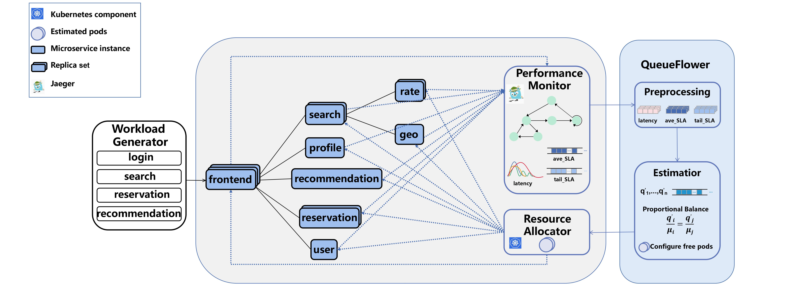

# QueueFlower: Orchestrating Microservice Workflows via Dynamic Queue Balancing
This repository is an artifact for the paper: `QueueFlower: Orchestrating Microservice Workflows via Dynamic Queue Balancing`[(pdf)](tbd) by Hongchen Cao*, Xinrui Liu*, Hengquan Guo, Jingzhu He, and Xin Liu (* both are leading authors) at Shanghaitech. The paper will be published at **The International Conference on Web Services (ICWS), July 2024**.

In microservices, requests' workflows with the complex dependency graphs pose challenges to auto-scaling strategies. This paper presents QueueFlower, an adaptive, dependency-agnostic, and lightweight auto-scaling framework for orchestrating microservice workflows. QueueFlower leverages real-time latency feedback to estimate queue lengths, effectively identifying congested services without offline profiling. Unlike previous methods that build dependency graphs between services, QueueFlower operates on individual services and adjusts resources proportionally based on estimated queues, ensuring resources of services are balanced globally. QueueFlower is theoretically grounded by fairness scheduling in stochastic networks and guarantees low requests' latencies. We have implemented a prototype of QueueFlower and evaluated its performance on a real-world microservice application. The experimental results demonstrate that compared to baseline methods, QueueFlower significantly reduces request latencies and percentages of SLA violations under stationary and non-stationary workloads. 

## Overview
As shown in the following figure, the performance monitor keeps capturing runtime trace data of requests from the microservice system. 
QueueFlower then preprocesses the data, estimates the per-service queues, and optimizes the resource allocation via a queue balancing algorithm. 
The resource allocator deploys the pod allocation into the microservice application.



## Setup environment
- A Kubernetes cluster with the microservice system in [DeathstarBench](https://github.com/delimitrou/DeathStarBench)
- Python environment according to [environment.yml](./environment.yml)
- To enable and test HPA please follow [the offical documentation](https://kubernetes.io/docs/tasks/run-application/horizontal-pod-autoscale-walkthrough/) 
- To monitor the overhead of Jaeger, please install [Prometheus](https://prometheus.io/) on k8s cluster

## Modules in QueueFlower
We implement different modules of POBO in separate Python scripts as follows:

- [Algorithm](./algorithm.py): Main algorithm of QueueFlower. We also implement the baseline HAB in this script.
- [Jaeger Collector](./jaegerCollector.py): We use Jaeger to implement end-to-end distributed tracing. QueueFlower collects tracing data by leveraging Jaeger's exposed RESTful APIs. To change the sampling rate please refer to [DeathstarBench Documentation](https://github.com/delimitrou/DeathStarBench)
- [Resource Manager](./k8sManager.py): We implement the pod number controller by leveraging the Kubernetes Python client.
- [Workload Generator](./wrk2LoadGenerator.py): We use the commonly used HTTP benchmarking tool wrk2~\cite{wrk2} as the workload generator to send four types of requests, i.e., login, search, reservation, and recommendation, to the application. We provide the functions for generating stationary and non-stationary workload. Wrk2 provides APIs for setting different thread numbers, the number of HTTP connections, the number of requests, the duration, and etc. You can change these parameters according to your cluster configuration.
- [Utils](./utils.py): Helper functions for calculating intermediate results through the pipeline of QueueFlower.
- [Experiment](./main.py): Simply run this bash to replicate our experiment. Certain parameters may need adjustment before execution to align with your environment. For example the endpoints of Jaeger and microservice, cpu and memory limit of pod.

## Citation
If you use QueueFlower in your research, please cite the paper as follows.
```
@inproceedings{cao2023queueflower
title={QueueFlower: Orchestrating Microservice Workflows via Dynamic Queue Balancing},
author={Hongchen Cao and Xinrui Liu and Hengquan Guo and Jingzhu He and Xin Liu},
booktitle={The International Conference on Web Services (ICWS), July 7-13, 2024},
year={2024},
}
```
